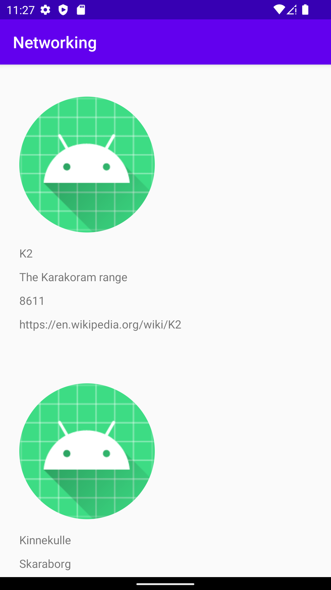

# Rapport

It started with the creation of the recycleView layout that would be used in the program. 
The recycleView layout is called mountain_list and is used to display info.

Followed by the creation of variables that would correspond to data from the json file.

```
 public Mountain(String id, String name, String location, int size, Auxdata auxdata) {
        this.id = id;
        this.name = name;
        this.location = location;
        this.size = size;
        this.auxdata = auxdata;
    }
```

The RecyclerViewAdapter will adapt data. The adapter will transform the data so it can be displayed in the recyclerview.

Bellow is the code that bind variables to assets in mountain_list
```
 private TextView name, location, size, wiki;

        public MountainViewHolder(final View itemView) {
            super(itemView);
            name = itemView.findViewById(R.id.Name);
            location = itemView.findViewById(R.id.location);
            size = itemView.findViewById(R.id.height);
            wiki = itemView.findViewById(R.id.wiki);
```
Auxdata was created due to the json containing it. The Auxdata class serve a similar purpose to the Mountain class, but for Auxdata instead. (Mountain class is the class containing the variables).
```
 public Auxdata(String wiki, String img) {
        this.wiki = wiki;
        this.img= img;
    }
```
Json data is imported with a url and then executed on 'onPostExecute'. The json data is then converted to java classes with gson. 
The variables in the json is then match with other variables created in the program.
```
 public void onPostExecute(String json) {
        Log.d("MainActivity", json);
        Gson gson = new Gson();
        Type type = new TypeToken<ArrayList<Mountain>>(){}.getType();
        mountains = gson.fromJson(json, type);
        RecyclerViewAdapter recyclerViewAdapter = new RecyclerViewAdapter(mountains);

        RecyclerView.LayoutManager layoutManager = new LinearLayoutManager(getApplicationContext());
        recyclerView = findViewById(R.id.recycle_view);
        recyclerView.setLayoutManager(layoutManager);
        recyclerView.setItemAnimator(new DefaultItemAnimator());
        recyclerView.setAdapter(recyclerViewAdapter);
    }
```

Down bellow is a screenshot of the app running. Images do not show up in the app due to the code implementing them not being finished.




